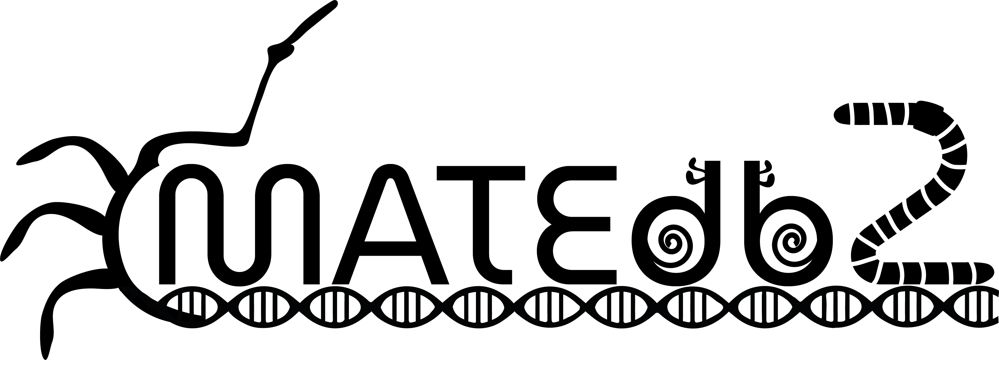
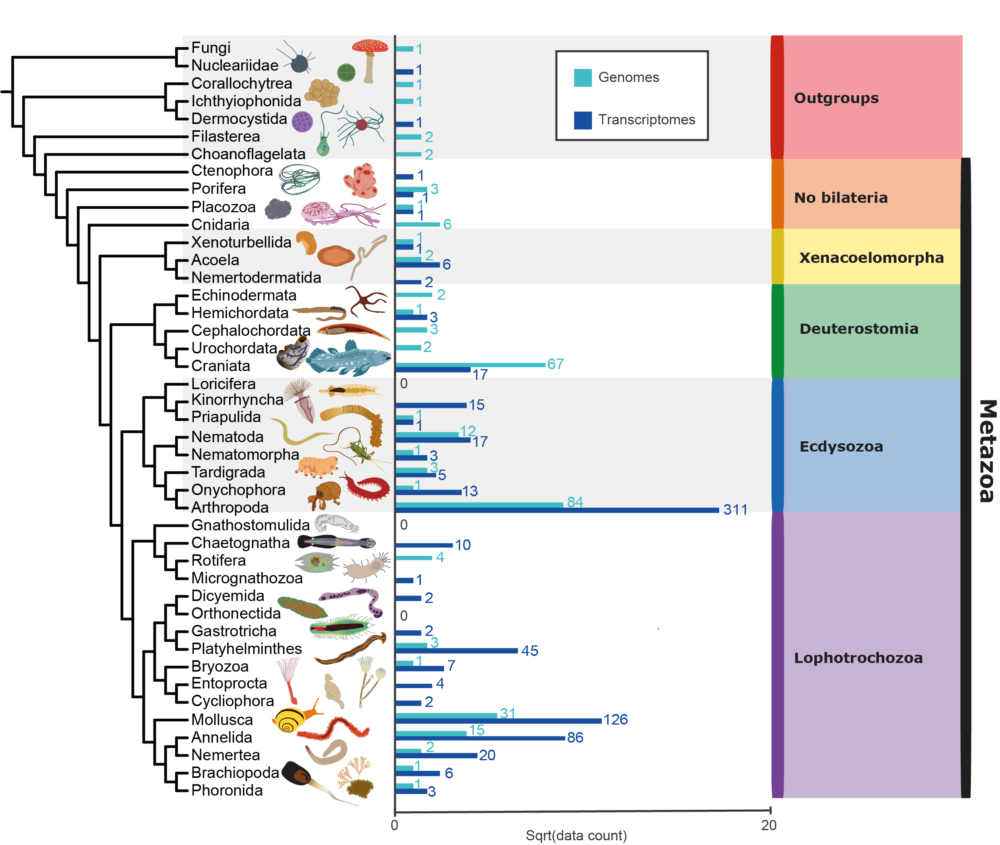
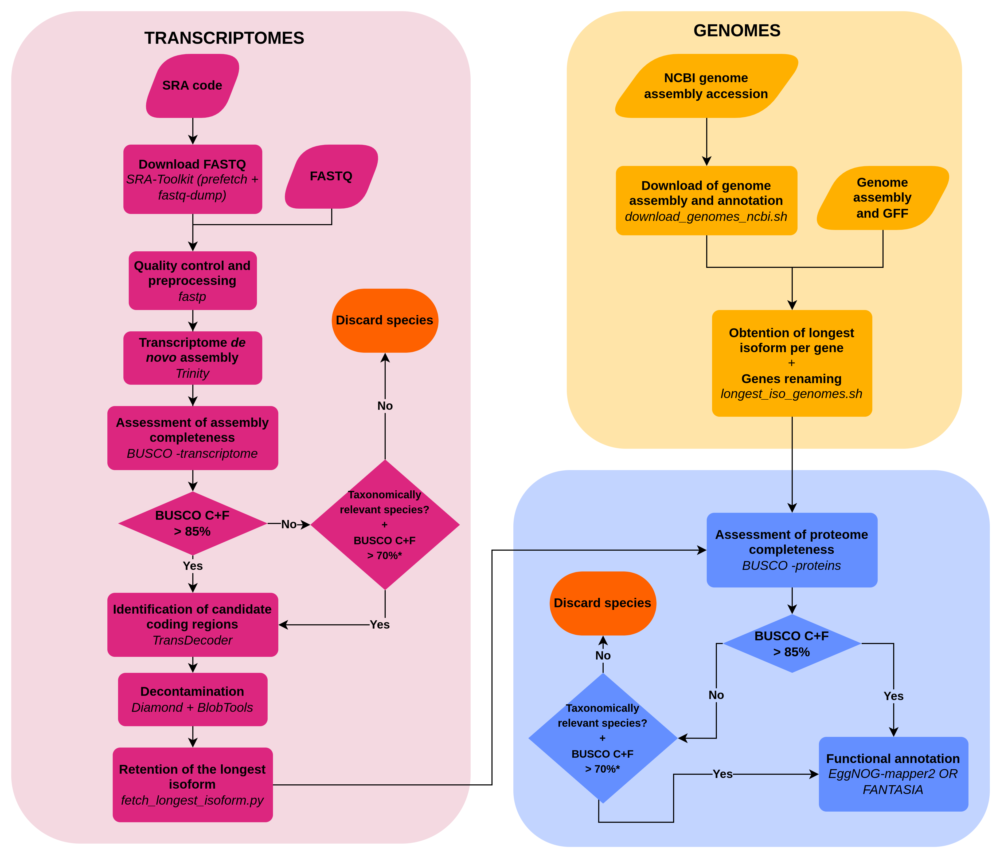

#  MATEdb2: Metazoan Assemblies from Transcriptomic Ensembles v2

[](http://www.gnu.org/licenses/gpl.html)

MATEdb2 (Metazoan Assemblies from Transcriptomic Ensembles) is the second version of a previously published database of high-quality transcriptome assemblies from arthropods and mollusks and obtained using the same pipeline ([MATEdb](https://github.com/MetazoaPhylogenomicsLab/MATEdb/tree/main)). This newer version increases the number of species to 970 from virtually all animal phyla, includes a standardized pipeline for genomes and provides new functional annotation based on natural language processing ([FANTASIA](https://github.com/MetazoaPhylogenomicsLab/FANTASIA)). For transcriptomes, the repository contains (1) *de novo* transcriptome assembly, (2) its candidate coding regions within transcripts (both at the level of nucleotide and amino acid sequences), (3) the coding regions filtered using their contamination profile (ie, only metazoan content or eukaryote for outgroups), (4) the longest isoforms of the amino acid candidate coding regions, (5) the gene content completeness score as assessed against the BUSCO reference sets, and (6) orthology (eggNOG-mapper) and protein language-based gene annotations ([FANTASIA](https://github.com/MetazoaPhylogenomicsLab/FANTASIA)), and per-protein ProtT5 embeddings. In the case of genomes, only files (4), (5), and (6) are provided in MATEdb2, together with a filtered version of the file (3) with just the longest CDS per gene. 

We invite the community to provide suggestions for new data sets and new annotation features to be included in subsequent versions, that will be permanently stored in public repositories.



## MATEdb2 database

Provisionally, links to data can be found in the `linksforMATEdb2.txt` file.

## Data under embargo

Some of the data contained in this database have been generated in our lab and will be used in future publications. We invite others to utilize the data we provide, but we request that they acknowledge our priority in presenting the findings regarding genome-wide analyses for phylogenetic and evolutionary analyses first. This includes publications in scientific journals, pre-print servers like bioRxiv, presentations at public conferences, and press releases. We kindly ask all users to adhere to this embargo policy. As datasets become accessible for use, this section will be updated accordingly.

<details>
<summary><b>Species under embargo</b></summary>
</br>

- *Hirudo medicinalis*

- *Arenicola marina*

- *Ligia oceanica*

- *Physella acuta*

- *Theba pisana*

- *Siphonaria pectinata*

- *Phorcus turbinatus*

- *Leptonemertes chalicophora*

- *Tetrastemma longissimum*

- *Tetrastemma melanocephalum*

- *Lineus sanguineus*

- *Bipalium kewense*

- *Caenoplana bicolor*

- *Geoplana quagga*

- *Issoca rezendei*

- *Kontikia ventrolineata*

- *Luteostriata ernesti*

- *Microplana groga*

- *Microplana plurioculata*

- *Microplana scharffi*

- *Microplana nana*

- *Microplana terrestris*

- *Obama braunsi*

- *Obama carinata*

- *Obama nungara*

- *Rhynchodemus sylvaticus*
</details>

## How to cite the data repository

Martínez-Redondo, Gemma I., Cargas-Chávez, Carlos, Eleftheriadi, Klara, Benítez-Álvarez, Lisandra, Vázquez-Valls, Marçal & Fernández, Rosa. MATEdb2, a collection of high-quality metazoan proteomes across the Animal Tree of Life to speed up phylogenomic studies. (2024). 

## Metadata (Needs update of columns name and contents)

MATEdb version 2 comprises 970 species, 961 animals (250 genomes and 711 transcriptomes) and 9 outgroups (7 genomes and 2 transcriptomes). These species belong to at least 628 families which are grouped in 254 orders which are further grouped in 92 different classes. 23,481,754 proteins are included in the final dataset with eggNOG annotation (including some lines without GO term annotation but with annotation of other types) for 16,390,000 of them and FANTASIA annotation for 23,184,398 of them. In the Data folder you can find the **Table_S1.txt** file which contains the metadata for all species in the database.

- Columns Phylum, Lineage, Class, Order, Family, and 'Scientific name' use the described the taxonomy of each species.

- Taxon ID refers to the id used by [NCBI Taxonomy](https://www.ncbi.nlm.nih.gov/taxonomy).

- Code refers to a four letter code that was selected for each species followed by a number.	Genome_or_Transcriptome	refers to whether the data available for that species comes from a genome or a transcriptome.

- Technology refers to the sequencing technology used to generate the data.

- Source and Accession_Number refer to the database used to obtain the raw data and the accession number under which it is stored.

- Reference refers to the publication associated with the data used.

- Extra refers to some additional information regarding the data origin or assembly.

- BUSCO_Database refers to the BUSCO dataset that was used to estimate the genome completeness.

- Trinity_C_plus_F, Trinity_C, Trinity_S, Trinity_D, Trinity_F and Trinity_M refer to the % of Complete plus Fragmented, Complete, Complete Single-copy, Complete Duplicated, Fragmented and Missing genes from the Trinity assembly.

- Protein_Number refers to the final number of proteins after keeping only the longest isoform for each gene.

- C_plus_F, C, S, D, F and M refer to the % of Complete plus Fragmented, Complete, Complete Single-copy, Complete Duplicated, Fragmented and Missing genes after conserving only the longest isoform for each gene.

- EggNOG-mapper refers to the number of proteins that have a functional annotation obtained with eggNOG-mapper.

- FANTASIA refers to the number of proteins that have a functional annotation obtained with FANTASIA.

## Executing the pipeline

We provide all the commands and scripts (**Scripts** folder) needed to download the raw data and process it to obtain all files in MATEdb2. We also provide a [singularity](https://cloud.sylabs.io/library/klarael.metazomics/matedb2/matedb2.sif) container with the software that was used to generate all the files with the required versions.

<details>
<summary><b>Download the MATEdb2 singularity</b></summary>
</br>
-From the server: [MATEdb2](https://cloud.sylabs.io/library/klarael.metazomics/matedb2/matedb2.sif)

-Through the command line ([singularity](https://docs.sylabs.io/guides/3.0/user-guide/installation.html) has to be installed):
```
singularity pull --arch amd64 library://klarael.metazomics/matedb2/matedb2.sif:1.0
```

Check the download by printing the help message: ```singularity inspect --helpfile matedb2.sif_1.0.sif```
</details>

</br>
Here you can see a diagram of the pipeline used to generate the data in MATEdb2 followed by a detailed description of the execution of every step using the singularity container.



#### 1.- Downloading the raw data

Either directly from a browser, going to a data repository:

- NCBI: https://www.ncbi.nlm.nih.gov

- Figshare: https://figshare.com

- etc.

Or using the SRA Toolkit version 2.10.7.
```
singularity exec matedb2.sif_1.0.sif prefetch SRR1157986
singularity exec matedb2.sif_1.0.sif fastq-dump --defline-seq '@$sn[_$rn]/$ri' --split-files $STORE/Craterostigmus_tasmanianus/SRR1157986 -O $STORE/Craterostigmus_tasmanianus/SRR1157986
```
For more information see https://github.com/ncbi/sra-tools/wiki/HowTo:-fasterq-dump

#### 2.- Quality check

To remove the adapters, clean and filter the data we use fastp 0.20.1.
```
singularity exec matedb2.sif_1.0.sif fastp --detect_adapter_for_pe -i ./Craterostigmus_tasmanianus/SRR1157986/SRR1157986_1.fastq -o ./Craterostigmus_tasmanianus/SRR1157986/SRR1157986_1_trimmed.fastq -I ./Craterostigmus_tasmanianus/SRR1157986/SRR1157986_2.fastq -O ./Craterostigmus_tasmanianus/SRR1157986/SRR1157986_2_trimmed.fastq
```

#### 3.- Transcriptome assembly

The transcriptomes were assembled using Trinity 2.11.0.
```
singularity exec matedb2.sif_1.0.sif Trinity --seqType fq --left ./Craterostigmus_tasmanianus/SRR1157986/SRR1157986_1_trimmed.fastq --right ./Craterostigmus_tasmanianus/SRR1157986/SRR1157986_2_trimmed.fastq --CPU 24 --max_memory 48G --output trinity --monitoring --no_parallel_norm_stats --full_cleanup --no_version_check
```

#### 4.- Change filenames and headers

The name and the headers of the outputs of Trinity are modified using the following commands outside the MATEdb2 singularity:
```
mv trinity.Trinity.fasta CTAS1.trinity.fasta
grep ">" CTAS1.trinity.fasta | sed 's/>//g' > original_headings_CTAS1.txt
paste trinity.Trinity.fasta.gene_trans_map original_headings_CTAS1.txt > CTAS1_conversion.txt
sed 's/TRINITY/CTAS1/g; s/ .*//g' CTAS1.trinity.fasta > CTAS1.mod.trinity.fasta
```

#### 5.- Quality assessment of the assembly

The quality of the assembly was assessed with BUSCO 5.3.2 and against the metazoa_odb10.
```
singularity exec matedb2.sif_1.0.sif busco -i CTAS1.mod.trinity.fasta -l metazoa_odb10 -o Busco -m transcriptome
```

Among the output files we focused on a file called short_summary.specific.*.Busco.txt where we can see the resulting statistics from comparing our assembly against the database used.
It gives the number of Complete BUSCOs (C), Complete and single-copy BUSCOs (S), Complete and duplicated BUSCOs (D), Fragmented BUSCOs (F) and Missing BUSCOs (M) and the fraction out of the total of BUSCO groups searched.
From these values we added that of C + F and if this sum is > 85% we considered that the assembly is of good quality. We lowered this threshold to 70% for some species that were of taxonomic relevance.
Note: the limit values of 85% and 70% were decided by our group.

#### 6.- Extract Open Reading Frames (ORFs)

The ORFs from the transcriptome assembly were identified using TransDecoder 5.5.0.
```
singularity exec matedb2.sif_1.0.sif TransDecoder.LongOrfs -t CTAS1.mod.trinity.fasta
counts=$(grep -c '>' CTAS1.mod.trinity.fasta.transdecoder_dir/longest_orfs.pep)
singularity exec matedb2.sif_1.0.sif_1.0.sif TransDecoder.Predict -t CTAS1.mod.trinity.fasta -T $((counts/4))
```

#### 7.- Elimination of foreign contaminant sequences

The taxonomy of the sequences in the TransDecoder output files was determined using BlobTools 2.3.3 and sequences which did not belong to the expected taxonomical group were discarded. First DIAMOND 2.0.8 was used to compare against the nr database which was downloaded in December 2020 from NCBI.
```
singularity exec matedb2.sif_1.0.sif diamond blastp --query CTAS1.mod.trinity.fasta.transdecoder.pep --db nr.dmnd --sensitive --max-target-seqs 1 --evalue 1e-10 --threads 24 --outfmt 6 qseqid staxids bitscore qseqid sseqid pident length mismatch gapopen qstart qend sstart send evalue bitscore --out CTAS1.diamond.blastp.out

mkdir BlobDir
singularity exec matedb2.sif_1.0.sif blobtools create --fasta CTAS1.mod.trinity.fasta.transdecoder.cds --hits CTAS1.diamond.blastp.out --hits-cols 1=qseqid,2=staxids,3=bitscore,5=sseqid,10=sstart,11=send,14=evalue --taxrule bestsum --taxdump taxdump BlobDir

singularity exec matedb2.sif_1.0.sif python extract_phyla_for_blobtools.py BlobDir/bestsum_phylum.json | sed "s/', '/,/g" | tr -d "[]'" > contaminants.txt
PHYLA=$(cat contaminants.txt)

singularity exec matedb2.sif_1.0.sif blobtools filter --param bestsum_phylum--Keys="$PHYLA" --taxrule bestsum --fasta CTAS1.mod.trinity.fasta.transdecoder.cds --summary STDOUT --summary-rank kingdom BlobDir >CTAS1.blobtools.summary

singularity exec matedb2.sif_1.0.sif blobtools filter --param bestsum_phylum--Keys="$PHYLA" --taxrule bestsum --fasta CTAS1.mod.trinity.fasta.transdecoder.pep BlobDir
```

#### 8.- BUSCO scores for the filtered sequences

BUSCO scores were calculated, as previously mentioned, to assess the effects of the filtering by taxonomy.

#### 9.- Obtain the longest isoform for each gene

The **fetch_longest_iso.py** script was used to obtain the longest isoform for each gene.
For the transcriptomes it is executed as follows:
```
singularity exec matedb2.sif_1.0.sif python fetch_longest_iso.py -i CTAS1.mod.trinity.fasta.transdecoder.filtered.pep -o CTAS1.longiso.pep -t -l
```

For the genomes:
To download a genome file along with the annotation you can use the script **download_genomes_ncbi.sh** you can oibtain the longest isoforms using the script **longest_iso_genomes.sh**.

```
singularity exec matedb2.sif_1.0.sif bash download_genomes_ncbi.sh -a GCF_000151315.2 -s COWC1.fna -g COWC1.gff
singularity exec matedb2.sif_1.0.sif bash longest_iso_genomes.sh -s COWC1.fna -g COWC1.gff -p COWC1_longiso.pep -c COWC1_longiso.cds -t COWC1
```

#### 10.- BUSCO scores for longest isoforms

BUSCO scores were calculated, as previously mentioned, to assess the effects of keeping only the longest isoform for each gene.

#### 11.- Annotate the longest isoforms using eggNOG-mapper

To annotate the longest isoforms we used eggNOG-mapper 2.1.6 against the eukaryota DIAMOND database (which can be downloaded using the download_eggnog_data.py script).
```
singularity exec emapper.py -i CTAS1.longiso.pep -o CTAS1 --itype proteins --matrix BLOSUM62 --dmnd_db Eukaryota.dmnd --cpu 18 --dbmem --go_evidence all --output_dir results
```
